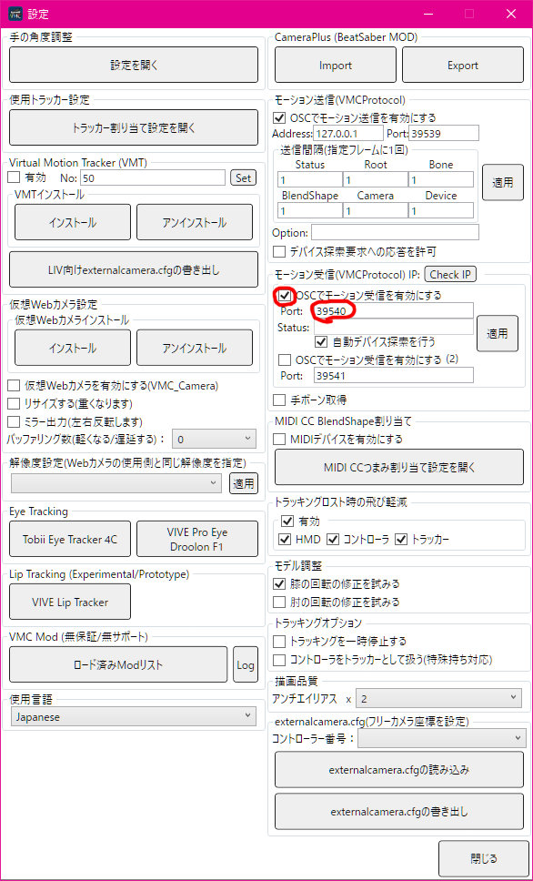

# VMCSaber

Draw Saber on Virtual Motion Capture

## Requirements

* [Virtual Motion Capture v0.52b7+](https://akira.fanbox.cc/)
* [VMCSaber-BS v0.2.0](https://github.com/aplulu/VMCSaber-BS)

## Download

 * [VMCSaber.zip (Latest)](https://github.com/aplulu/VMCSaber/releases/latest/download/VMCSaber.zip)

## Installation

Unzip the contents in `VMCSaber.zip` and place it in your Virtual Motion Capture installation directory. (e.g. `C:\Program Files (x86)\VirtualMotionCapture`)

## Usage

Enable Motion Receive from the Advanced Settings of VirtualMotionCapture and make sure the receive port matches the VMCSaber-BS setting. (Default is 39540.)

## Contact

 * Twitter [@aplulu_cat](https://twitter.com/aplulu_cat)
 * Discord Aplulu#2369
